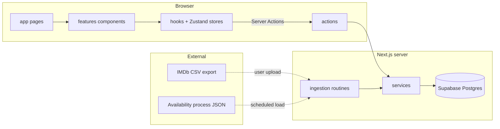

# Rikuna — Project Architecture

This document describes the high-level structure and conventions of the **Rikuna** codebase: a personal (multi-user-ready) planner for streaming rotation — cross-referencing a user's IMDb watch history against what is currently available on their active streaming subscription, plus curated public/private watchlists.

For step-by-step guidance when adding a new resource or screen, mirror the pattern of an existing sibling folder under `features/` and `actions/` before introducing a new top-level folder.

## Technology stack

| Layer               | Choice                                                                                  |
| ------------------- | --------------------------------------------------------------------------------------- |
| Framework           | **Next.js 16** (App Router), **React 19**                                               |
| Language            | **TypeScript** (`strict`)                                                               |
| Backend / data      | **Supabase** (Postgres 15+, Auth, Row Level Security for per-user isolation)            |
| Supabase in Next.js | **`@supabase/ssr`** — separate server and browser clients                               |
| Client state        | **Zustand** (feature stores + global user store)                                        |
| UI                  | **Tailwind CSS 4**, **shadcn/ui** (style: `lyra`, base color: `mist`), **Lucide** icons |
| Forms / tables      | **react-hook-form**, **TanStack React Table**                                           |
| Theming             | **next-themes** (dark mode default)                                                     |
| Toasts              | **Sonner**                                                                              |

Import alias: `@/*` maps to the repository root (`tsconfig.json`).

> UI styling details (style, base color, component choices per screen) are documented separately in `vistas-y-estilo-rikuna.md`; this file covers structure, not visual design.

## Architectural style

The app follows a **layered + feature-sliced** layout, same discipline as other Supabase/Next.js projects in this workspace:

1. **`app/`** — routing, layouts, and thin page shells. Pages compose feature modules and call server actions or pass server-fetched data as props.
2. **`actions/`** — **Server Actions** (`"use server"`). Session checks, `revalidatePath`, orchestration, and delegation to services.
3. **`services/`** — **data access and domain orchestration** against Supabase. Service classes receive a `SupabaseClient` (dependency injection from the action layer). Centralizes `.from(...).select(...)` shapes and row-to-DTO mapping.
4. **`features/`** — **vertical slices** per product area: screens, client hooks, and Zustand stores co-located by feature (e.g. `features/library/`, `features/lists/`).
5. **`components/`** — **shared** presentation: layout shell (nav, header), generic dialogs, domain widgets (`MediaCard`, `AvailabilityBadge`), shadcn primitives under `components/ui/`.
6. **`types/`** — shared TypeScript models and enums exported via barrel files.
7. **`lib/`** — framework adapters and utilities (Supabase factories, `cn`, fonts).
8. **`constants/`** — static configuration (recommendation thresholds, supported countries/platforms metadata).
9. **`ingestion/`** — server-only scripts/routines for processing external catalog files (see [Catalog Ingestion](#catalog-ingestion)) and parsing IMDb CSV exports. Not part of the request/response cycle for normal pages.
10. **`hooks/`** — cross-feature client hooks (e.g. `useSession`, `useActiveSubscription`).
11. **`stores/`** — cross-cutting client state (e.g. `UserStore` hydrated from `UserProvider`).
12. **`supabase/`** — migrations, local config, and auth email templates. Schema changes are **only** applied via new timestamped files in `supabase/migrations/`.

## Routing (`app/`)

- **Root layout** (`app/layout.tsx`): fonts, global CSS, `ThemeProvider` (dark default), `Toaster`.
- **Route group `(marketing)`**: `app/(marketing)/page.tsx` → `/`. Public entry point (previously missing). Redirects to `/panel` if a session already exists; otherwise renders the Header + Sidebar in their unauthenticated variant (see `vistas-y-estilo-rikuna.md`, Section 1.6).
- **Route group `(auth)`**: `app/auth/*` — login, sign-up, password flows, and route handlers such as `auth/callback` and `auth/confirm` for Supabase Auth. No guard needed; redirects to `/panel` if already authenticated. No Header/Sidebar shell.
- **Route group `(app)`**: authenticated area — `Header` (with avatar/user menu) + `Sidebar` (authenticated variant) shell, `AuthCheck` using `createClient()` from `@/lib/supabase/server`, redirects unauthenticated users to `/auth/login`, loads `getCurrentUser()`, wraps children in `UserProvider`.
- **Route group `(public)`**: unauthenticated, read-only content — public lists and public title pages. Minimal shell only (logo + "Iniciar sesión"), **no sidebar** — intentional, so a shared list link doesn't drag the recipient into full site navigation. **Must not** sit inside `(app)` or be touched by its auth guard; this is what makes list sharing work without an account (see `schema-basedatos-rikuna.md`, Section 9.2).

**Routes (per `vistas-y-estilo-rikuna.md`):**

| Area            | Paths                                                                                              | Shell                     |
| --------------- | -------------------------------------------------------------------------------------------------- | ------------------------- |
| Marketing       | `/` (Inicio)                                                                                       | Header + Sidebar (unauth) |
| Auth            | `/auth/login`, `/auth/sign-up`, `/auth/forgot-password`, `/auth/update-password`                   | None                      |
| Panel           | `/panel` ("Qué ver este mes" — landing after login)                                                | Header + Sidebar (auth)   |
| Recomendaciones | `/recomendaciones`                                                                                 | Header + Sidebar (auth)   |
| Biblioteca      | `/biblioteca`                                                                                      | Header + Sidebar (auth)   |
| Título (auth)   | `/titulo/[slug]`                                                                                   | Header + Sidebar (auth)   |
| Listas          | `/mis-listas`, `/mis-listas/[slug]`                                                                | Header + Sidebar (auth)   |
| Suscripciones   | `/suscripciones`                                                                                   | Header + Sidebar (auth)   |
| Importación     | `/importar`, `/importar/[batchId]`                                                                 | Header + Sidebar (auth)   |
| Perfil          | `/perfil`                                                                                          | Header + Sidebar (auth)   |
| **Público**     | `/l/[codigo]` (lista pública), `/titulo/[slug]` (variante de solo lectura sin acciones personales) | Minimal (logo only)       |

Because there **is** public, unauthenticated content (`(marketing)` and `(public)`), route protection must be enforced explicitly in `middleware.ts` (or the `(app)` layout guard) rather than defaulting every route to "protected" — the opposite risk from a fully private admin tool. `lib/supabase/proxy.ts` exports `updateSession()`, called from `middleware.ts`, and must special-case `(marketing)`, `(public)`, and `auth/*` paths as pass-through.

## Supabase integration (`lib/supabase/`)

| Module      | Role                                                                                                                                                                                          |
| ----------- | --------------------------------------------------------------------------------------------------------------------------------------------------------------------------------------------- |
| `server.ts` | `createServerClient` bound to Next.js `cookies()` — use in Server Components, Server Actions, services called from them.                                                                      |
| `client.ts` | `createBrowserClient` for client components when browser access to Supabase is required.                                                                                                      |
| `admin.ts`  | **Service role** client — server-only; used exclusively by `ingestion/` routines (catalog snapshot loading, stub enrichment). Never imported from client bundles or from user-facing actions. |
| `proxy.ts`  | Session refresh + route-guard helper consumed by `middleware.ts`.                                                                                                                             |

Environment variables include `NEXT_PUBLIC_SUPABASE_URL`, `NEXT_PUBLIC_SUPABASE_ANON_KEY`, and `SUPABASE_SERVICE_ROLE_KEY` (ingestion only).

### Database (migrations)

The canonical schema is described in full, with rationale, in `schema-basedatos-rikuna.md`. Design principles carried into the migrations:

- **Per-user isolation** via `user_id` on personal tables; RLS on all tables.
- **Public-by-flag** exception: `user_lists` / `list_items` are readable without a session when `is_public = true` (the one deliberate departure from "everything requires auth").
- **UUID** application PKs throughout.
- **`imdb_id`** (IMDb's `tconst`) is the universal join key for catalog data — unique and required on `media_items`.
- **Time-aware availability**, not static links: `media_availability` tracks `is_available` / `last_seen_at` / `last_snapshot_id` so monthly catalog rotation is detectable, not assumed.

**Core domains in Postgres (not exhaustive — see schema doc for full DDL):**

| Domain        | Main tables / notes                                                                      |
| ------------- | ---------------------------------------------------------------------------------------- |
| Catalog       | `media_items`, `genres`, `media_genres`, `people`, `media_people`, `seasons`, `episodes` |
| Availability  | `platforms`, `catalog_snapshots`, `media_availability`                                   |
| Personal data | `user_subscriptions`, `user_media_status`, `user_lists`, `list_items`                    |
| Imports       | `imdb_import_batches`, `imdb_import_rows`                                                |

Always read the latest files in `supabase/migrations/` and `schema-basedatos-rikuna.md` before changing data access code — the availability model in particular has non-obvious upsert/expire logic (Section 3.3 of the schema doc).

## Catalog Ingestion

Rikuna has four ingestion paths, all server-only and all distinct from normal user-triggered Server Actions:

1. **Availability snapshots** (`ingestion/catalog/`) — consumes the periodic JSON produced by the external platform+country process. Creates a `catalog_snapshots` row, upserts `media_items` (by `imdb_id`) and `media_availability`, then expires anything not seen in that snapshot. Runs on a schedule, using the `admin.ts` service-role client (no end-user session involved).
2. **IMDb CSV import** (`ingestion/imdb-import/`) — triggered by an authenticated user uploading their _Ratings_ or _Watchlist_ export from `/importar`. Runs under the user's own session (RLS applies normally; no service role needed here since the user is only ever writing their own rows). Creates stub `media_items` for unmatched titles instead of discarding them.

   **The IMDb id is the only column required.** A full IMDb export, a one-column `imdb_id` list and a headerless list of bare ids all parse — the id column is matched by normalized header name (`Const`, `imdb_id`, `tconst`, …), and a first line that itself looks like an id is treated as data, not a header. Everything else is optional because path 3 recovers it from TMDB. A row is only skipped when its id fails the `tt\d+` shape, since a bad id would poison the join key that every ingestion path shares.

   When no title is supplied, the IMDb id stands in for both `title` and `slug` (both NOT NULL). The TMDB sync recognizes that placeholder by `title === imdb_id` and rewrites the slug along with the real title, so an id-only import doesn't leave the ficha stranded at `/titulo/tt0111161`.

3. **TMDB catalog sync** (`ingestion/tmdb-sync/`) — fills in what the other two paths leave NULL (`poster_url`, `description`, `tmdb_id`, `original_title`, `end_year`, `content_rating`, `imdb_url`, `enriched_at`), links real genres, writes the lead cast as `media_people` rows with `role='actor'`, and flips `is_stub` to `false`. Progress is tracked per row by `media_items.tmdb_sync_status` (`pending | synced | not_found | failed`). Triggered from `/sincronizar`, and chained automatically after a CSV import for that batch's new titles.

   This is the one path reachable from an end-user flow that uses the `admin.ts` service-role client, and the exception is deliberate: `media_items` is global shared data with **no** RLS `UPDATE` policy for `authenticated`, and adding one would let any signed-in user rewrite the catalog from the browser. The Server Action (`actions/tmdb-sync/`) verifies the session with the caller's own RLS-scoped client and only then delegates into `ingestion/`, which owns the privileged client. Reads (the backlog counters) never use it.

   The run is driven **one batch per request** from the client (`features/tmdb-sync/useTmdbSyncRunner`) rather than as a single long action — that's what keeps each request far from a function timeout and makes a real progress bar possible.

4. **Availability sync** (`ingestion/availability-sync/`) — looks up where each title can be watched and fills in `media_availability` with one row per (platform, country, offer type) plus the watch link. Progress is tracked per row by `media_items.availability_sync_status` (`pending | synced | not_found | failed`) with the timestamp in `availability_synced_at`. Triggered from `/sincronizar/disponibilidad`.

   **JustWatch is the primary source and TMDB the fallback.** They carry the same catalog — TMDB licenses JustWatch's data — but TMDB's `/watch/providers` strips the per-provider deep link and returns only a link back to its own watch page, so a badge would open `themoviedb.org` instead of `paramountplus.com`. JustWatch's GraphQL endpoint still exposes it as `standardWebURL`, and its `packageId` values share TMDB's provider-id namespace, so platform matching is identical either way. It's a fallback rather than a merge because JustWatch is a superset of what TMDB reports for a title it knows.

   That endpoint is undocumented and unversioned (introspection disabled; JustWatch sells a commercial API for the same data), so two things contain the risk: titles are matched **strictly by IMDb id** — a fuzzy title match wouldn't produce a missing link, it would produce a confident link to the wrong film — and any JustWatch failure is caught per title and downgraded to TMDB, so an outage costs link quality, never coverage. `JUSTWATCH_ENABLED=false` turns the whole path off. Cost is two requests per title (search, then one aliased query covering all eight countries), three when it falls back.

   **Only platforms already in `platforms` get rows** — an unmatched provider is skipped and its raw name is reported back in the run summary, which is how `constants/tmdbProviders.ts`'s alias table gets extended. Matching is by normalised name rather than `provider_id_movie`/`provider_id_tv`, because a platform has several provider ids upstream and those columns hold one integer each; they're filled in as auditable metadata by a separate one-off action and nothing depends on them.

   `media_availability.source` (`catalog | tmdb`) keeps the two writers from fighting. The `tmdb` value marks the row as owned by this pipeline regardless of which upstream supplied the URL. `MediaAvailabilityServices.expireStale()` (path 1) is scoped to `source='catalog'`, because it expires anything whose `last_snapshot_id` isn't the current run's — and TMDB rows belong to no snapshot, so without the scope every catalog load would silently switch off every TMDB link. TMDB's side reconciles per title instead (`reconcileForMedia`): one call returns the complete truth for a title, so it upserts what it saw and expires the rest of that title's `source='tmdb'` rows. Same service-role rationale and same one-batch-per-request client loop as path 3.

The first two write their run history (`catalog_snapshots`, `imdb_import_batches` / `imdb_import_rows`) so failures and partial matches are inspectable from the UI (`/importar/[batchId]`); the syncs' equivalent is the per-row `tmdb_sync_status` / `availability_sync_status`, which is also what stops a re-run from retrying titles TMDB genuinely doesn't have.

## Server Actions (`actions/`)

Organized by domain with barrel `index.ts` files:

| Folder            | Purpose                                                                       |
| ----------------- | ----------------------------------------------------------------------------- |
| `auth`            | Sign in, sign up, sign out (used by the Header's user menu), password reset   |
| `media`           | Title detail reads, search/filter for biblioteca and the explorar catalog read |
| `media-status`    | Mark watched / want-to-watch / dismissed (`user_media_status` writes)         |
| `subscriptions`   | Activate/close `user_subscriptions`                                           |
| `lists`           | CRUD for `user_lists` / `list_items`, visibility toggle, share link           |
| `imdb-import`     | Accept upload, kick off `ingestion/imdb-import/`, expose batch status         |
| `tmdb-sync`       | Backlog counters and one-batch-at-a-time catalog enrichment via TMDB          |
| `availability-sync` | Backlog counters and one-batch-at-a-time watch-provider lookup via TMDB      |
| `recommendations` | "Qué ver este mes" and discovery queries (Sections 8.1–8.2 of the schema doc) |

Typical responsibilities:

- Verify session (`supabase.auth.getUser()`).
- Instantiate the matching service with the same Supabase client instance RLS sees (so per-user isolation is enforced by Postgres, not by application logic).
- Call `revalidatePath` after mutations (e.g. marking watched revalidates `/panel`, `/biblioteca`, and the affected `/titulo/[slug]`).

Public reads (`/l/[codigo]`) go through **services** directly from a Server Component using the anonymous-capable server client — they don't need an `actions/` entry since there's no mutation or session check involved.

## Services (`services/`)

Each domain folder exports a service class that accepts a `SupabaseClient` in the constructor and centralizes query shapes and DTO mapping. No `revalidatePath`, `cookies()`, or auth checks belong here — that stays in `actions/`.

**Exported services** (`services/index.ts`):

- `MediaServices` — catalog reads, filters, search. Two filtered reads that look alike but aren't: `getManyWithFilters` narrows a caller-supplied id list (biblioteca's own rows), while `getCatalogWithFilters` queries the catalog itself for `/explorar` — no starting list, so it resolves the genre/platform filters into one and keeps the unfiltered case a single indexed query with a result cap
- `MediaAvailabilityServices` — availability lookups joined with `user_subscriptions`, plus both write paths into `media_availability`: the catalog's snapshot-scoped `upsert`/`expireStale` and the TMDB sync's per-title `reconcileForMedia`
- `MediaStatusServices` — watched / want-to-watch / dismissed reads and writes
- `SubscriptionServices`
- `ListServices` — includes the public-list read path (no `user_id` filter when `is_public`)
- `ImdbImportServices` — row-level match/create logic against `media_items`
- `CatalogSnapshotServices` — used only by `ingestion/catalog/`
- `TmdbSyncServices` — backlog counters (any client) plus the enrichment writes and genre/cast linking (service-role client only)
- `AvailabilitySyncServices` — the availability queue: backlog counters and the platform list (any client), status writes and the `provider_id` backfill (service-role client only). A deliberate sibling of `TmdbSyncServices` rather than a generalization of it — different projections and filters, and reworking that class would put `/sincronizar` and the `/importar` chain at risk

## Features (`features/`)

Feature modules mirror product areas defined in `vistas-y-estilo-rikuna.md`:

| Feature           | Typical structure                                                                                                              |
| ----------------- | ------------------------------------------------------------------------------------------------------------------------------ |
| `panel`           | "Qué ver este mes" screen, hooks, store                                                                                        |
| `recommendations` | Discovery + watchlist-available sections, genre filter                                                                         |
| `library`         | Tabs (Vistas / Quiero ver / Todas), filters, search                                                                            |
| `explore`         | Whole-catalog table **or** poster grid with column filters plus the two relational ones (genre, platform+country); URL holds both the filters and the chosen view |
| `title`           | Detail view — shared between authenticated and public variants, with an `isPublicView` flag gating the personal-action buttons |
| `lists`           | `list`, `detail`, `create`, visibility toggle, share-link component                                                            |
| `subscriptions`   | Active subscription card, history table, activate form                                                                         |
| `import`          | Upload dropzone, batch history, batch detail table, chained TMDB pass for the new titles                                       |
| `tmdb-sync`       | Backlog screen, the batch-loop runner hook, progress bar and run summary (shared with `import`)                                |
| `availability-sync` | Same shape for the watch-provider pass, with a richer summary: per-title errors and the TMDB providers skipped for having no `platforms` row |
| `profile`         | Account settings, theme toggle                                                                                                 |

**Pattern (all features):** Server Components fetch via actions/services and pass **initial data** into client feature components. Client hooks combine **Zustand** (filters, UI flags) with **Server Actions** for mutations.

## Shared UI (`components/`)

- **`layout/`** — `Header` (logo, user avatar + `DropdownMenu` when authenticated, "Iniciar sesión"/"Crear cuenta" buttons when not — full spec in `vistas-y-estilo-rikuna.md` Section 1.6) and `Sidebar` (two content variants, authenticated vs. not, same section). Both render in `(marketing)` and `(app)`; `(public)` uses a stripped-down header only, no sidebar, no user menu.
- **`Pagination/`** — the page-size selector and prev/next controls, shared by `Table/DataTable` and by Explorar's card grid so two views of the same data can't paginate differently. Presentational only: the caller owns the state, since the table keeps it inside TanStack and the grid in a `useState`.
- **`ui/`** — shadcn-generated primitives, `style: lyra`, `baseColor: mist` (see `vistas-y-estilo-rikuna.md` for the full component-per-screen mapping).
- **`MediaCard/`** — poster + title + year + rating badge; the single most reused component across panel, recommendations, biblioteca, lists, and public list view.
- **`AvailabilityBadge/`** — shows which platform(s) a title is on, highlighting the user's active subscription.
- **`Table/`** — `DataTable` wrapper (TanStack Table) for biblioteca and import-batch detail.
- **`Dialog/`** — `ConfirmDialog`, add-to-list dialog.
- **`providers/UserProvider.tsx`** — syncs server-loaded current user into `stores/UserStore.ts`.

## Types (`types/`)

Central definitions aggregated in `types/index.ts`, mapped 1:1 to the schema doc's tables:

- **Catalog:** `MediaItem` (includes `isStub`), `Genre`, `Person`, `Season`, `Episode`
- **Availability:** `Platform`, `CatalogSnapshot`, `MediaAvailability`
- **Personal:** `UserSubscription`, `UserMediaStatus`, `UserList`, `ListItem`
- **Imports:** `ImdbImportBatch`, `ImdbImportRow`

## Configs and constants

- **`constants/recommendationThresholds.ts`** — `minRating`, `minImdbVotes`, `minVotesFloor` used by the discovery query (mirrors the `thresholds` block already produced by the external availability process, so both sides agree on what counts as "well rated").
- **`constants/platforms.ts`** — known platform slugs/provider ids, used when mapping incoming catalog files to `platforms` rows.
- **`constants/conf.ts`** — project name ("Rikuna") and description.

## Conventions worth preserving

- Keep **Supabase queries and row mapping** in **services**, not duplicated across actions and UI.
- Keep **`"use server"`** boundaries in **`actions/`**; never import `lib/supabase/admin.ts` from client bundles or from `actions/` used by end-user flows — it's reserved for `ingestion/`.
- The **`(public)` route group is a deliberate exception**, not an oversight — don't wrap it in the `(app)` auth guard, and don't add personal-data queries to its pages.
- Prefer **feature folders** for screens tied to a domain; promote to **`components/`** only when reused across features.
- **English** for code identifiers and developer-facing strings; user-visible copy is Spanish (see product spec).
- **Do not edit** existing migration files; add a new `YYYYMMDDHHMMSS_<name>.sql` for schema changes.
- Treat `is_stub` on `media_items` as a real UI state, not an edge case — anything rendering a `MediaCard` should handle a missing poster/synopsis gracefully.

## Running the app

- Dev: `npm run dev`
- Build / start: `npm run build`, `npm start`
- Lint: `npm run lint`
- Local Supabase: `supabase db reset` (wipe + replay migrations), `supabase db push` (apply pending only)

---

_Update this file when you introduce new domains, auth boundaries, database areas, or deployment topology. Related documents: `documento-especificacion-rikuna.md` (product spec), `schema-basedatos-rikuna.md` (full DDL + query rationale), `vistas-y-estilo-rikuna.md` (screens + design system)._
